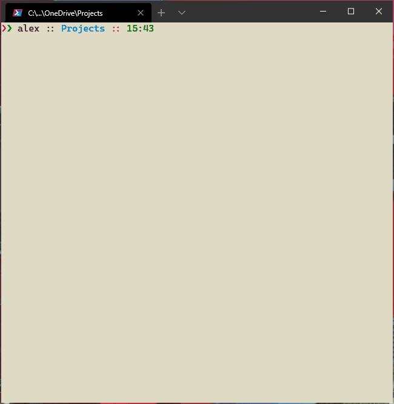

# Dragon 🐉

`dragon` is a CLI tool that you can use to create and update Windows Subsystem for Linux 2 VMs from Docker images/containers.

`dragon` is intended to be used in the context of development-environments-as-code as described in [project-dev-palace](https://github.com/alexchiri/project-dev-palace) but it can be used just as a simple tool to manage WSL VMs created from Docker containers.

## Usage

* start with `dragon new` to create a WSL VM from a Dockerimage from a public or private registry. This creates a recordin a config file called .dockerwsl, pulls the image locally,creates a WSL VM from it and adds a profile in the WindowsTerminal settings.json file. When this is done, you should seethe VM in the list of Windows Terminal shells and be able toconnect to it. **WARNING: it will remove all comments from thesettings.json file!**
* periodically run `dragon update`. Available only for ACRhosted Docker images. It uses the `az` CLI to determine themost recent tag, which then puts in the `.dockerwsl` configfile in the `latest` property for that WSL.
* periodically run `dragon upgrade`, which creates a new WSLVM from the tag specified in the `latest` property. WSL VMsare named using the WSL name provided and the tag. If `latest`points to a new tag, then a new VM is created with the newname. If `latest` is the same, then the VM is replaced.
* run `docker run` to connect to a WSL VM. It is used in the Windows Terminal profile to connect to the VM.

For convenience, set the following environment variables:
* `DOCKERWSL_PATH` - location of the .dockerwsl file. It is created if it doesn't exist.
* `WT_SETTINGS_PATH` - location of the Windows Terminal settings.json file.
* `AZ_CLI_PATH` - location of the `az.cmd` binary. Only needed for `dragon update`.

## Requirements

`dragon` is using several tools that need to be installed on the machine it will run on:
    * `az` CLI is needed for `dragon update`. The path to the CLI binary needs to be passed as a parameter to the command or a `AZ_CLI_PATH` environment variable needs to be set.
    * `wsl` CLI is used for `dragon upgrade` to list, delete and import VMs.
    * `docker` CLI and Desktop need to be available. Used for pulling images, creating containers from images and exporting them to tars.
    * Windows Terminal settings.json file. `dragon new` tries to create a new profile in the Windows Terminal settings file.

## TODO
* Implement `dragon cleanup` that deletes all WSL VMs except the last version
* Make Windows Terminal profile creation optional.
* `dragon remove` to delete WSLs from .dockerwsl file, WSL VMs and profile from Windows Terminal settings.json.
* Not use `az` CLI